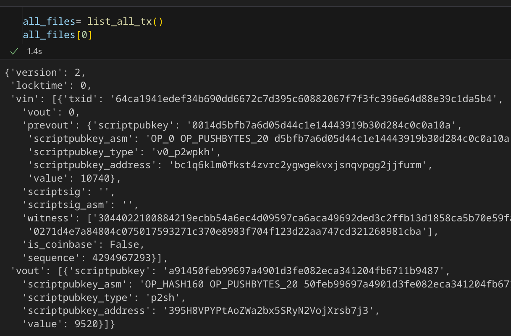
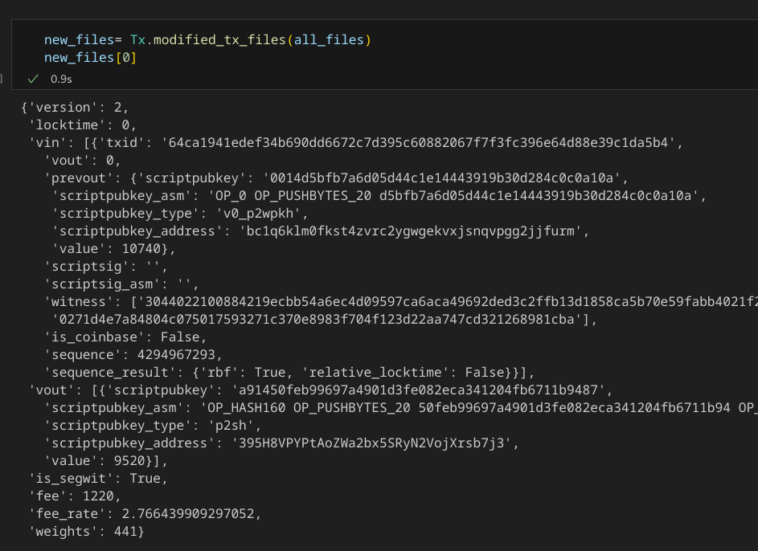
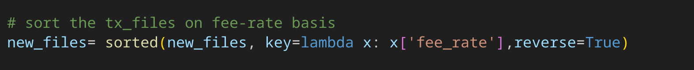
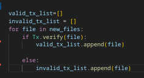
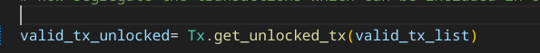
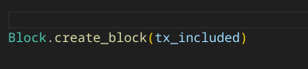

# Design Approach:


- ### EDA (Exploratory Data Analysis) on the tx_files given in mempool folder in `data.ipynb`->
    - having basic sanity checks like -> is amount non-negative or not, scriptpubkey matches with its asm part etc.
    -  explore various details about given tx -> which type of scripts are used, which tx are locktime enabled etc.
    -  Modifies tx json files -> replacing `unknown` keyword in script-type to `bare-multisig`
 - ### Details in main.py
    - #### create  a list `all_files`
       -  where each element represents a tx_json file 
          

       -  created by calling `list_all_tx` function in `Helper.md` -> which just iterates over the files in mempool -> copy contents and append it in a list and return it
       

    -  #### Add additional fields in each transaction in `all_file` and create a new list `new_files` containing these transaction
       -  Used `modified_tx_files` function
         
           

       -  This function will add new field as follows -> 
          -  `is_segwit`  -> tells whether a given transaction is segwit or not -> useful while serializing tx (`serliaze`) , calculating tx's sig_hash (`get_sig_hash`)
          -  `fee` -> fee associated with that transaction
          -  `fee_rate` -> fee rate (`fee/weight of tx`) of that transaction -> helps to sort tx  in `new_files` on descending order of fee-rate
          -  `weights` -> calculated weight associated with that tx
          -  `sequence_result` -> It tells whether `rbf` , `locktime(absolute & relative)` features are enabled or not for that tx , whose value is discussed in implementation details section
  

    -   #### Sort `new_files` list of `fee-rate` field in each modified transaction json file
         

         - Doing this will help us in selecting  valid transactions with high `fee-rate` for including them in our block 
         - This will maximize  our fee amount collected from given set  of transactions
   
   
    -   #### Validate all transactions in `new_files` and segregate all valid and invalid tx.
       
        

        - Initiate two list `valid_tx_list` -> contains all valid tx  & `invalid_tx_list` -> contains all invalid tx
        - Here we pass all the modified tx in new_files to `Tx.verify`  function (implementation in next section) , which will return a boolean value whether a given tx is valid or not.
        - Accordingly those tx will be appended in their respective type list.


    -    #### Segregate from valid transactions which can be included in our block i.e do not have any locktime constraints
             

         - `Tx.get_unlocked_tx` function takes the valid transaction list (`valid_tx_list`) and returns a new list `valid_tx_unlocked` which have no `locktime` constraints i.e They can be included in our block 
  

    
  
   -    #### Create block :
        

        `Block.create_block` function takes all the rest heavy-lifting  by calling other sub-functions which includes:
         - get all transactions which are to be included in block and associated details
         - create coinbase transaction
         - create a block
         - find a correct nonce to make our block valid
         - print all the required contents in `output.txt` file
  


# Implementation Details:

## Code Structure->

* I have created many files each works for a specific field as explained ->
  - **Helper.py** : It includes all the functions which are not very much bitcoin specific , but are useful to have them.
     - `list_all_tx()`:
        -  Initiate a empty list
        -  Iterate over transaction files in mempool folder
        -  Append each file to list and return it at the end
     - `merkle_root(hashes)`:
        - It gives merkle root of given list of transaction hashes.
        - It takes `tx hashes` not `tx ids`.
     - and Other functions like `encode_varint`, `read_varint`,`decode_num` ,`encode_num` , `int_to_little_endian` and `little_endian_to_int` etc
 
 
  - **data.ipynb** : This python notebook includes the EDA(Exploratory Data Analysis) on the tx_files given in mempool folder

  - **ecc.py**: It contains all the logic about `elliptic curves` and its related application like `public key` & `Signature` etc.
     - #### **While I'm aware that it's permissible to utilize cryptographic libraries, I opted to undertake the process as a self-learning exercise to grasp the fundamentals of blockchain from the ground level.** 
     - It includes several cryptographic classes like `S256Field`, `S256Point` etc
     - `Signature` class:
        -  Represents digital signature on the message by using the private key
        -  `der`function -> It serializes signature instances into `DER` format 
        -  `parse` -> This function return the Signature instance from its `DER` format
  


  - **Opcodes.py**: It includes all the opcodes we have in bitcoin scripts and their implementation
     - `OP_CODE_NAMES`:A dict which maps a opcode to its corresponding byte representation.
     - `get_function_by_name`-> this function will give the function object from the string 
     - Implementation of only those  opcodes which are used in tx files 
     - `OP_PUSHNUM`
        - This has many variants starting `OP_PUSHNUM1` to `OP_PUSHNUM16` 
        - Instead of just implementing each variant I created a single function as -> 
         ```python
            def OP_PUSHNUM(stack,pushnum_cmd):    
            elements= pushnum_cmd.split("_")
            no = int(elements[2])
            stack.append(encode_num(no))
            return True
          ```

          - Take the opcode name -> OP_PUSHNUM(stack, `OP_PUSHNUM14`) -> extract the no and append it in stack


      - `OP_PUSHBYTES`:
        - Since I am using `asm` part of any script -> `OP_PUSHBYTES` variants opcode does not mean a lot -> since  
 - **Transaction.py**: It includes `Tx` , `TransactionInput` and `TransactionOutput` class and their implementation:
        - `Tx` class: represents whole transaction
      - `modified_tx_files` function 

      -  `serialize` func:
              - It gives serliased form a given transactionn    
              - Depending  on  `file["is_segwit"]` value -> It calls differnt serialization function mentioned in this file
      ``` python
             @classmethod
             def serialize(cls,file):
                 if file["is_segwit"] == True:
                     return Tx.serialize_segwit(file)
                 else:
                     return Tx.serialize_legacy(file)
      ``` 

        
      - `sig_hash_legacy` func -> It gives signature hash (on which we sign with our private     key) for legacy transaction      
    

      - `sig_hash_legacy` func -> give signature hash for segwit transaction
       
      
 
      - `Tx.verify(tx_file)`: 
             - iterate over each input and call `Tx.verify_input(file,input_index)`.
             - If for any input -> It get False -> then whole tx will be invalid
             - If It get True for all inputs -> then only the tx will be valid
     
      - `Tx.verify_input(file,input_index)`: 
             - verify Transactoin inputs of given index -> checks whether the script sig unlocks scriptpubkey or not

         ```python 
             def verify_input(cls,file,input_index):
                # for now I am not verfying pay-to-taproot script -> just return that it is passing

                # check whether the scrip_pubkey is p2sh

                  # If yes,then check that the given script-pubkey relates to p2wpkh /p2wsh by using
                   'is_p2wpkh_script_pubkey(script_pubkey_asm) / is_p2wsh_script_pubkey(script_pubkey_asm) functions'

                     # If yes, then find the signature hash for tx (sig_hash_bip143) and witness


                  # If it is simple Pure p2sh script -> then find signature hash using sig_hash_legacy function 

                # If it is not even P2SH ->  then check whether it belongs to native segwit or not -> If yes, then find corresponding sig_hash and witness


                # If it is not native segwit -> It may be of type P2PKH etc -> find legacy sig_hash.


                # combined = script_sig + script_pubkey
                 'Script.evaluate(combined,z,witness)'  # for script evaluation          
         ``` 
     
     - Other function are -> `get_witness_commitment` & `get_serliased_coinbase_tx` etc.
   
   
    - `Transaction_Input` Class: 
       -  Represents any Tx input 
       -  **Fields** -> (`prev_txid`,`vout`)
       -  `serialize` function -> serialize given Tx input
       
       
    - `Transaction_Output` class:
       -  Represents a tx output
       -  `serialize` -> serialize given Tx ouptut


  


  - **Script.py**: Contains all script related logic
       - **parse** function :It is used for testing whether we are given correct asm of script or not
       - **evaluate(commands,signature hash,witness)** function : It evaluates the combined script (`script_sig + script_pubkey`) -> and returns a bool.
          - **True** -> script_sig successfully unlocks script_pubkey of prev_tx input 
          - **False** -> script_sig do not unlocks prev_tx input -> tx is invalid

  - **Block.py**: It includes `Block` class and related logic implementation details
      - `Block` Class:
         - **Fields**-> (`version`,`prev_block`, `merkle_root`,`timestamp`, `bits`, `nonce`,`tx_hashes`)
      
      - `MAX_BLOCK_SIZE= 4000000` -> max size of Block 
      - `BLOCK_HEADER_SIZE= 320` -> Size allocated to Block Header
      - `BLOCK_SIZE_FOR_TX= MAX_BLOCK_SIZE - BLOCK_HEADER_SIZE` -> size left for tx to be included in block
     
      -  `Block.get_mined_tx_data` -> Get all associated details about transaction which can be included in our block:
         - takes list of valid transaction which can be included in our block (i.e no locktime constraints) `valid_tx_unlocked` -> and returns a tuple `(tx_count,tx_included,fee_collected,weight_stored)` where:
           - `tx_count` -> no of transactions which can be included in block by considering maximum fee benefit & do not overflow block size for transactions ()
           -  `tx_included` 
              -  list of transactions to be included in block.
              -  arranged in descending order of `fee-rate`
           -  `fee_collected` -> fee obtained from including tx of `tx_included` in block
           -  `weight_stored` -> Total weights of all transactions in block
        
       - **Implementation**:
            - Iterate over tx in tx files list
            - Find`BLOCK_SIZE_FOR_TX -weight_stored > tx["weights]`:
              - **Yes** -> There is enough space for that transaction to be included in block
              - **No** : then check `weight_stored>= BLOCK_SIZE_FOR_TX`:
                  - **Yes** -> Some problem in algorithm, should not occur
                  - **No** -> i.e that particular tx's weights is higher than block space left -> in such case leave this tx and try for next one.  
 
     - ### `create_block(cls,tx_files)`:
        
         - get all tx to be included in block and its associated data by using `Block.get_mined_tx_data(tx_files)`.
          
         - create and get `Coinbase` tx in serliazed form from `Transacttions.Tx.get_serliased_coinbase_tx(fees_collected,tx_files)` 
          
         - create a list `tx_hashes_list` consists of transaction hashes of all valid tx which are to be included in block
      
         - generate merkle root which will be used in Block Header by using `merkle_root(tx_hashes_list)`
          
         - Initiate a block with the given values
         - serialize the block header using `serialize_blockheader(self)` function
         - get the correct nonce value to make our block valid `Proof of Work` by using `get_valid_nonce(self, target)` where target = `0000ffff00000000000000000000000000000000000000000000000000000000`
         - now get the block header in serialized form from valid block 
       

    

# Results:
  -  Result of this assignment is shown in `output.txt`
  -  Format of result:
     - Serialized Block Header
     - Serialized Coinbase Transaction
     - Tx Id of Coinbase Transaction
     - Tx Id of Regular Transactions

# Efficiency: 
  - For this challenge, my solution worked fine, but in real life, it needs to be better for handling more transactions quickly. To make it better, we need to check transactions faster, do more things at the same time to speed up, and use our computer resources smarter. 

# Conclusion:

   ### Insights gained by solving this problem:
   -  Well, It really provides me hands on experience right from reading details of any transaction to minning a valid, efficient block on the basis of fees collected,  block weight utilised.
   -  It also push  me a lot to deep dive the technical domain of Bitcoin like how different types of script work etc.
  
   ### Potential areas for future improvement or research:
   - Currently I have not validated inputs from `pay-to-taproot` script as it will be complex to implement for now -> thus, In the code , whenever I got this input script -> I just return True(it is valid)
   - For Now, I have just added a `sequence_result` field in tx files which will tell whether it has RBF enabled or not -> But I have not worked much upon this field.

   ### Resources used for solving the problem:
- **Bitcoin-Wiki** -> https://en.bitcoin.it/wiki/Main_Page
- **Learn me Bitcoin** -> https://learnmeabitcoin.com/
- **Programming Bitcoin**  by **Jimmy Song**-> https://github.com/jimmysong/programmingbitcoin 
- Codebase of **python-bitcoin-utils** : https://github.com/karask/python-bitcoin-utils
- **Mastering Bitcoin** : https://github.com/bitcoinbook/bitcoinbook